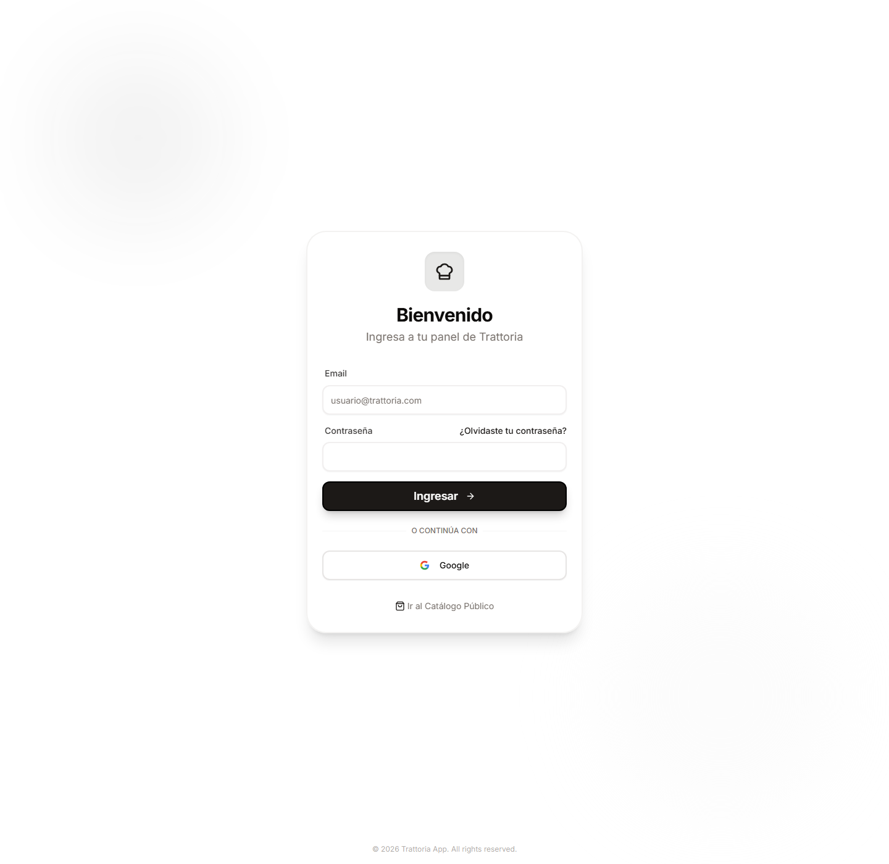

# Iniciar sesion

## Objetivo

Entrar al panel interno como usuario `ADMIN` para poder operar pedidos, inventario, productos y promociones.

## Rol y ruta

- Rol: `ADMIN`
- Ruta inicial: `/login`
- Ruta esperada al terminar: `/admin/dashboard`

## Antes de empezar

- Tener email y contrasena del usuario `ADMIN`.
- Confirmar que la app carga en `/login`.
- Si vienes desde el catalogo publico, no hace falta cerrar nada antes.

## Pasos exactos

1. Abrir la ruta `/login` o ubicar el boton superior a la derecha.
2. Verificar que aparezcan el titulo `Bienvenido` y el boton `Ingresar`.
3. Completar el campo `Email`.
4. Completar el campo `Contrasena`.
5. Hacer click en `Ingresar`.
6. Esperar la redireccion al panel interno.
7. Confirmar que la URL cambie a `/admin/dashboard`.
8. Verificar que en la navegacion aparezcan al menos `Pedidos`, `Insumos` y `Reportes`.

## Resultado esperado

El usuario entra al dashboard sin volver a ver la pantalla de login y queda habilitada la navegacion interna de administrador.

## Verificacion rapida

- La URL final es `/admin/dashboard`.
- El menu lateral o superior muestra secciones internas del panel.
- Ya no se ve el formulario con `Email` y `Contrasena`.

## Si algo no coincide

- Revisa que el email y la contrasena sean correctos.
- Si aparece un error en rojo, capturalo antes de reintentar.
- Si el boton `Ingresar` no responde, recarga `/login` y vuelve a probar.
- Si entras a otra ruta distinta de `/admin/dashboard`, confirma el rol del usuario.

## Referencias a otros flujos

- [Cerrar sesion](cerrar-sesion.md)
- [Navegar panel](../03-dashboard-admin/navegar-panel.md)
