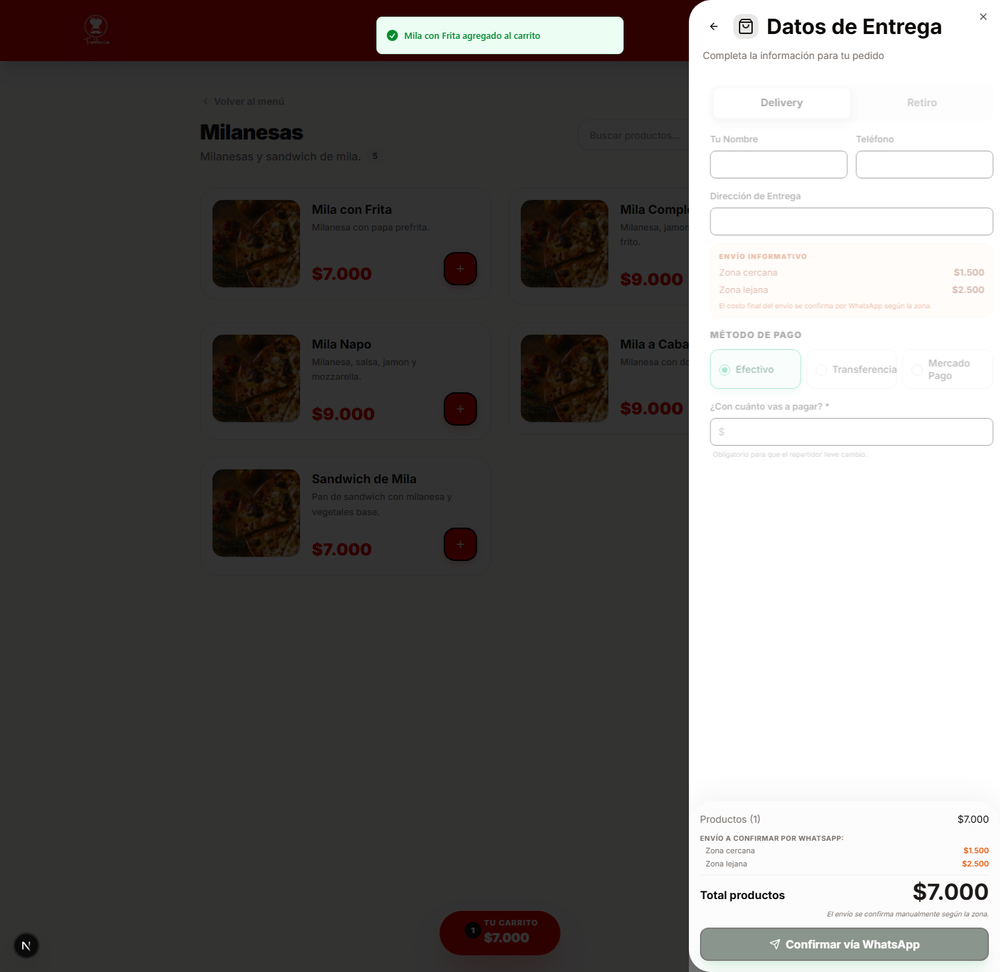

# Confirmar pedido por WhatsApp

## Objetivo

Completar el checkout publico y disparar el mensaje final de pedido por WhatsApp.

## Rol y ruta

- Rol: publico, sin login
- Ruta inicial sugerida: carrito con items
- Ruta esperada al terminar: intento de redireccion a WhatsApp con el mensaje del pedido

## Antes de empezar

- Haber completado [Armar carrito](armar-carrito.md).
- Tener al menos un producto cargado en el carrito.
- Si el local esta cerrado, este flujo puede quedar bloqueado por la propia UI.

## Pasos exactos

1. Abrir `Tu Carrito`.
2. Hacer click en `Continuar Pedido`.
3. Verificar que se abra la vista `Datos de Entrega`.
4. Elegir `Delivery` o `Retiro`.
5. Completar `Tu Nombre`.
6. Completar `Telefono`.
7. Si elegiste `Delivery`, completar `Direccion de Entrega`.
8. Elegir un `Metodo de Pago`.
9. Si elegiste `EFECTIVO`, completar `Con cuanto vas a pagar? *`.
10. Confirmar que el boton `Confirmar via WhatsApp` quede habilitado.
11. Hacer click en `Confirmar via WhatsApp`.
12. Verificar que la app intente abrir WhatsApp con el detalle del pedido.

## Resultado esperado

El sistema crea el pedido publico y arma un mensaje que incluye items, total de productos, tipo de entrega y datos del cliente.

## Verificacion rapida

- Con carrito vacio no debe aparecer `Continuar Pedido`.
- Si faltan datos obligatorios, `Confirmar via WhatsApp` debe seguir deshabilitado.
- En `Delivery`, la direccion es obligatoria.
- En `EFECTIVO`, el campo `Con cuanto vas a pagar? *` es obligatorio.
- El mensaje final deberia incluir `Tipo de entrega` y `Total productos`.

## Si algo no coincide

- Si ves un aviso de local cerrado, no fuerces la confirmacion: anotalo como condicion del negocio.
- Si el boton queda deshabilitado, revisa si falta direccion o monto para efectivo.
- Si WhatsApp no abre, confirma primero que el pedido se haya creado y luego revisa el dispositivo o navegador.

## Referencias a otros flujos

- [Armar carrito](armar-carrito.md)
- [Crear pedido manual](../04-pedidos/crear-pedido-manual.md)
