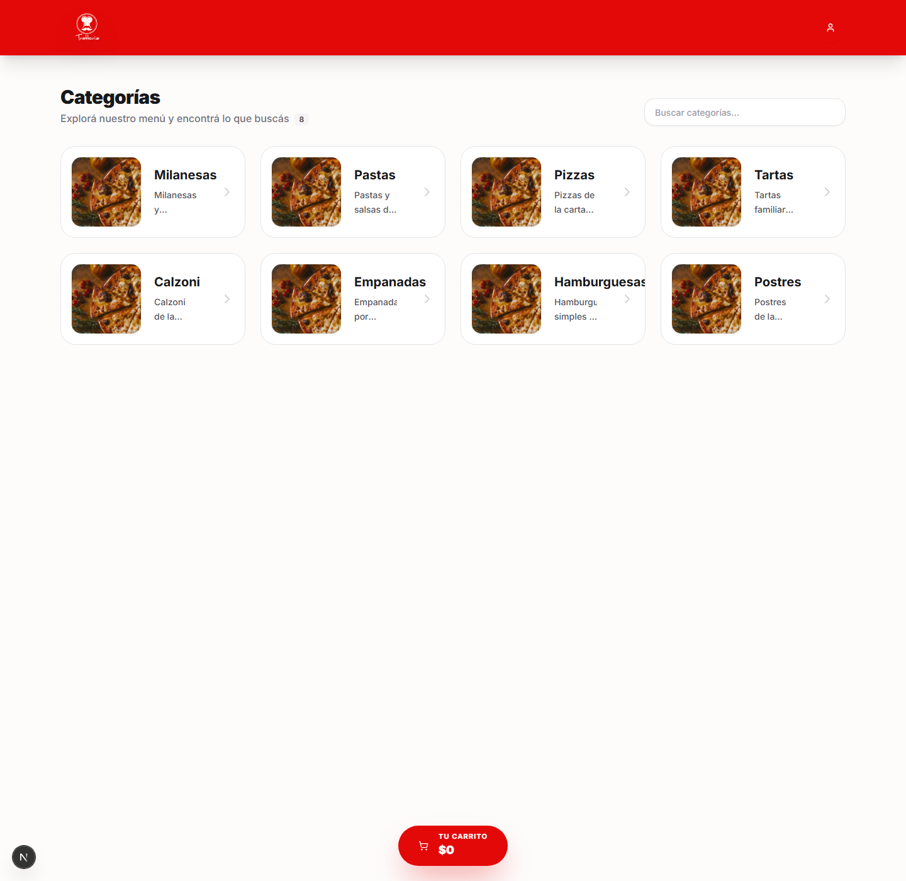

# Recorrer categorias

## Objetivo

Entrar al catalogo publico, buscar una categoria y abrirla para ver sus productos.

## Rol y ruta

- Rol: publico, sin login
- Ruta inicial: `/`
- Ruta esperada al terminar: `/categoria/[slug]`

## Antes de empezar

- La app debe estar disponible en `/`.
- No hace falta iniciar sesion.

## Pasos exactos

1. Abrir la ruta `/`.
2. Verificar que en el header aparezcan el logo de Trattoria y el boton `Mi Cuenta`.
3. Confirmar que el bloque principal muestre el titulo `Categorias`.
4. Usar el campo `Buscar categorias...` si quieres filtrar la grilla.
5. Hacer click en una tarjeta de categoria.
6. Esperar el cambio de ruta a `/categoria/[slug]`.
7. Verificar que la pagina de categoria muestre el nombre de la categoria como titulo principal.
8. Confirmar que exista el buscador `Buscar productos...`.

## Resultado esperado

La categoria elegida se abre correctamente y deja visible el listado de productos asociados.

## Verificacion rapida

- La home muestra categorias activas.
- El filtro por nombre reduce la grilla.
- Al entrar a una categoria, el titulo cambia y aparecen productos.

## Si algo no coincide

- Si la home muestra `El catalogo no esta disponible ahora`, anota el error y no sigas con el flujo publico.
- Si no aparecen categorias, revisa que existan categorias activas en el panel admin.
- Si la tarjeta no abre, recarga la home y vuelve a probar con otra categoria.

## Referencias a otros flujos

- [Armar carrito](armar-carrito.md)
- [Confirmar pedido por WhatsApp](confirmar-pedido-por-whatsapp.md)
