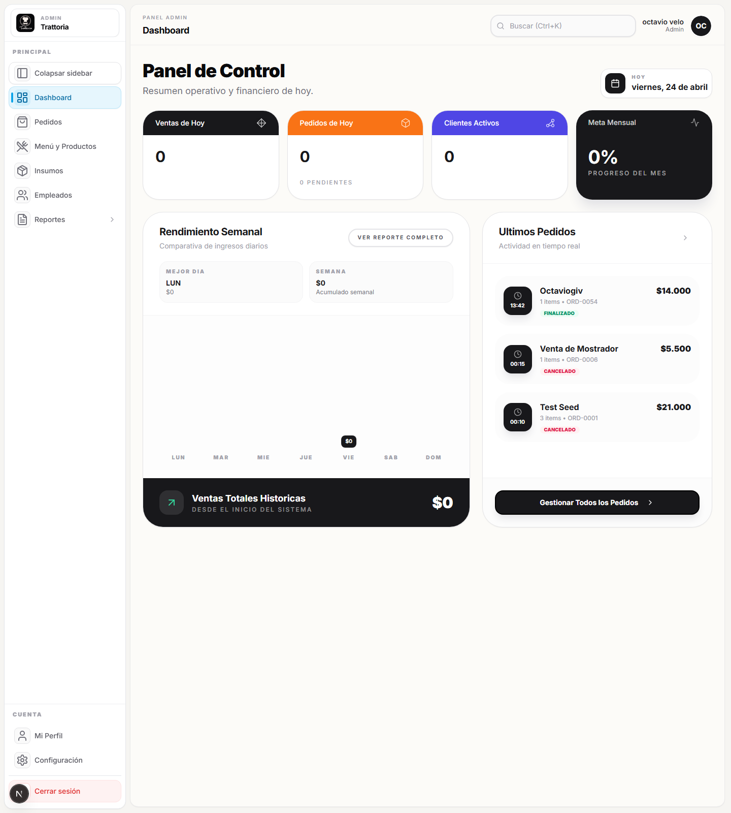

# Navegar panel

## Objetivo

Reconocer el dashboard inicial y ubicar desde donde se entra a pedidos, inventario, productos y promociones.

## Rol y ruta

- Rol: `ADMIN`
- Ruta inicial: `/admin/dashboard`
- Ruta esperada al terminar: conocer la navegacion base del panel

## Antes de empezar

- Haber completado [Iniciar sesion](../01-acceso/iniciar-sesion.md).

## Pasos exactos

1. Entrar a `/admin/dashboard`.
2. Verificar que el dashboard cargue sin volver al login.
3. Confirmar que se muestren KPI o tarjetas de resumen del negocio.
4. Ubicar el acceso rapido `Gestionar todos los pedidos` si esta visible.
5. Revisar la navegacion principal del panel.
6. Confirmar que existan al menos estas secciones: `Dashboard`, `Pedidos`, `Menu y Productos`, `Insumos`, `Reportes`.
7. Revisar tambien la zona de cuenta con `Mi Perfil` y `Configuracion`.
8. Volver siempre al dashboard cuando necesites reorientarte entre un flujo y otro.

## Resultado esperado

El operador entiende desde donde entrar a cada modulo y puede volver al dashboard como punto de control.

## Verificacion rapida

- El dashboard muestra informacion del negocio apenas entras.
- La navegacion deja entrar a `Pedidos`, `Insumos` y `Menu y Productos`.
- El panel sigue cargando aunque cambies entre secciones.

## Si algo no coincide

- Si faltan modulos, confirma que el usuario tenga rol `ADMIN`.
- Si el dashboard carga vacio, recarga la pagina una vez y vuelve a revisar.
- Si un acceso devuelve error, anota la ruta exacta y continua con otro flujo.

## Referencias a otros flujos

- [Crear pedido manual](../04-pedidos/crear-pedido-manual.md)
- [Crear insumo](../05-insumos/crear-insumo.md)
- [Crear categoria](../06-categorias/crear-categoria.md)
- [Crear producto con receta](../07-productos/crear-producto-con-receta.md)
- [Crear promocion con productos](../08-promociones/crear-promocion-con-productos.md)
