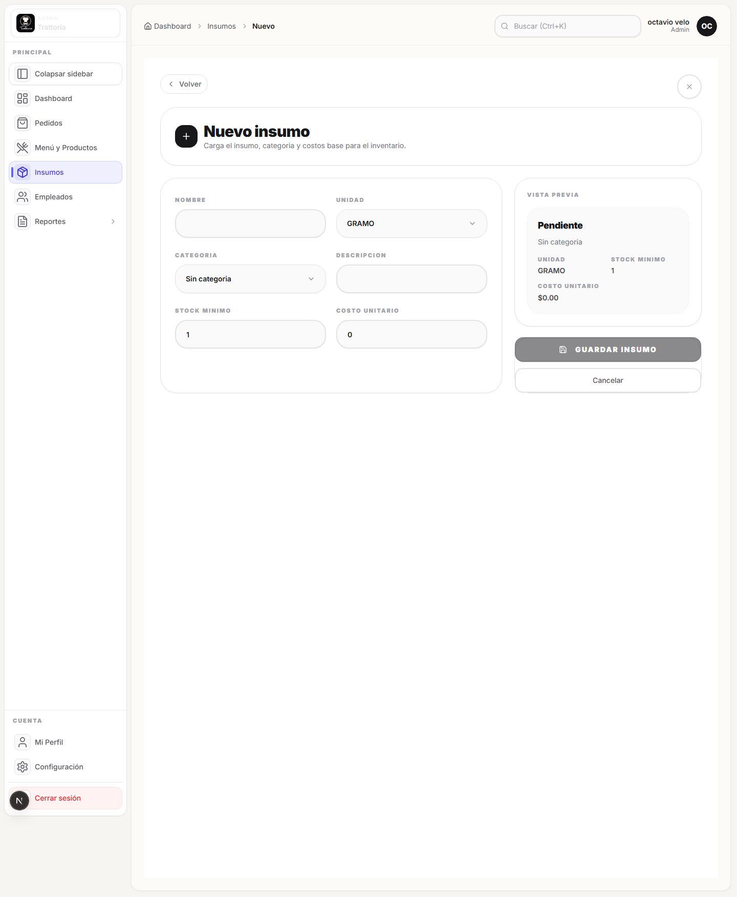

# Crear insumo

## Objetivo

Dar de alta un insumo base para inventario y para futuras recetas de producto.

## Rol y ruta

- Rol: `ADMIN`
- Ruta inicial: `/admin/dashboard/insumos`
- Ruta esperada al terminar: insumo visible en el listado de inventario

## Antes de empezar

- Haber completado [Iniciar sesion](../01-acceso/iniciar-sesion.md).
- Saber nombre, unidad, costo unitario y stock minimo del insumo.

## Pasos exactos

1. Entrar a `/admin/dashboard/insumos`.
2. Hacer click en `Nuevo Insumo`.
3. Esperar la ruta `/admin/dashboard/insumos/nuevo`.
4. Completar `Nombre`.
5. Elegir `Unidad`.
6. Elegir `Categoria` o dejar `Sin categoria` si todavia no corresponde clasificarlo.
7. Completar `Descripcion` si quieres dejar contexto operativo.
8. Completar `Stock minimo`.
9. Completar `Costo unitario`.
10. Revisar la tarjeta `Vista previa`.
11. Hacer click en `Guardar insumo`.
12. Esperar el mensaje `Insumo creado correctamente`.
13. Verificar que vuelvas al listado de insumos.
14. Buscar el insumo nuevo en la tabla.

## Resultado esperado

El insumo queda activo, aparece en el listado y ya puede seleccionarse despues en recetas o movimientos de stock.

## Verificacion rapida

- El alta no deja guardar si falta el nombre.
- El toast final indica que el insumo se creo bien.
- El insumo aparece en el listado al volver.

## Si algo no coincide

- Si no vuelve al listado, revisa si quedo algun campo obligatorio sin completar.
- Si la categoria correcta no existe, continua con `Sin categoria` y creala despues.
- Si el insumo no aparece en la tabla, usa el buscador del listado.

## Referencias a otros flujos

- [Registrar stock](registrar-stock.md)
- [Crear producto con receta](../07-productos/crear-producto-con-receta.md)
