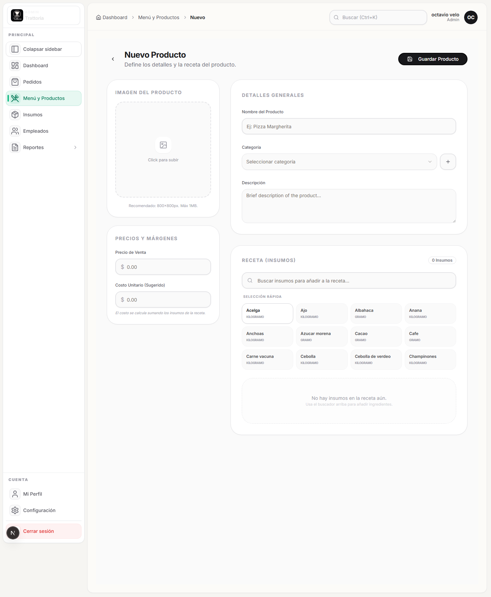

# Crear producto con receta

## Objetivo

Crear un producto del menu, asignarle categoria y cargar los insumos que componen su receta.

## Rol y ruta

- Rol: `ADMIN`
- Ruta inicial: `/admin/dashboard/productos`
- Ruta esperada al terminar: producto visible en `Menu y Productos`

## Antes de empezar

- Haber completado [Iniciar sesion](../01-acceso/iniciar-sesion.md).
- Tener al menos un insumo creado.
- Tener al menos una categoria normal creada.

## Pasos exactos

1. Entrar a `/admin/dashboard/productos`.
2. Hacer click en `Nuevo Producto`.
3. Esperar la ruta `/admin/dashboard/productos/nuevo`.
4. Si quieres, cargar una imagen en `Imagen del Producto`.
5. Completar `Precio de Venta`.
6. Revisar `Costo Unitario (Sugerido)`. Este valor puede actualizarse con la receta.
7. Completar `Nombre del Producto`.
8. Elegir la `Categoria`.
9. Si la categoria aun no existe, usa el boton `+` del selector o vuelve a [Crear categoria](../06-categorias/crear-categoria.md).
10. Completar `Descripcion`.
11. En `Receta (Insumos)`, usar `Buscar insumos para anadir a la receta...`.
12. Agregar cada insumo necesario a la receta.
13. Ajustar la cantidad por unidad para cada insumo.
14. Revisar que el costo sugerido tenga sentido con la receta cargada.
15. Hacer click en `Guardar Producto`.
16. Esperar el mensaje `Producto creado exitosamente`.
17. Verificar que la app vuelva al listado de productos.

## Resultado esperado

El producto queda activo en el menu interno, con categoria asignada y con receta de insumos lista para costeo y operacion.

## Verificacion rapida

- El producto aparece luego en `Menu y Productos`.
- La categoria elegida se muestra correctamente.
- La receta lista los insumos agregados con sus cantidades.
- El producto puede reutilizarse despues en promociones o pedidos internos.

## Si algo no coincide

- Si no aparecen insumos en el buscador de receta, vuelve a [Crear insumo](../05-insumos/crear-insumo.md).
- Si falta la categoria correcta, vuelve a [Crear categoria](../06-categorias/crear-categoria.md).
- Si el costo sugerido no tiene sentido, revisa cantidades y costos unitarios de cada insumo.

## Referencias a otros flujos

- [Crear insumo](../05-insumos/crear-insumo.md)
- [Crear categoria](../06-categorias/crear-categoria.md)
- [Crear promocion con productos](../08-promociones/crear-promocion-con-productos.md)
